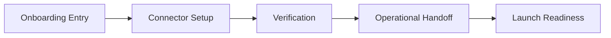

# Marveo Documentation Strategy

## Goals
- Help non-technical users connect and launch confidently.
- Give support officers clear onboarding and handoff workflows.
- Give developers and agencies practical integration guides.
- Keep docs aligned with current shipped capabilities.

## Audience Lenses
- Non-technical: outcome-first, short steps, screenshots/checklists.
- Support: verification checklists, escalation paths, handoff notes.
- Developers/agencies: integration sequence, environment expectations, troubleshooting.

## Information Architecture
- `docs/wordpress`: Existing WordPress connection and verification.
- `docs/nextjs`: Next.js adapter setup and operational content behavior.
- `docs/support`: Guided onboarding playbooks and handoff process.
- `docs/operations`: Pilot, launch readiness, and release management.
- `docs/troubleshooting`: Shared issue matrix and cross-stack diagnostics.
- `docs/glossary.md`: Shared operational language for all teams.

## New Core Playbooks
- `docs/support/escalation-severity-matrix.md`
- `docs/support/customer-handoff-template.md`
- `docs/operations/incident-response-playbook.md`
- `docs/nextjs/deployment-environment-checklist.md`

## Writing Standard (applies to all docs)
Each guide should include:
1. Purpose
2. When to use
3. Setup steps
4. Expected result
5. Troubleshooting

## Current Scope Guardrails
- Do not document APIs or automation endpoints that are not shipped.
- Mark planned capabilities as **Planned**.
- Prefer user outcomes over internal engineering implementation details.

## Cross-Doc Diagram Placeholder

