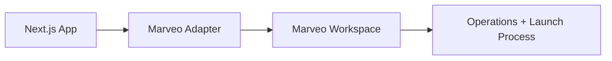

# Connect Next.js Site

## Purpose
Connect a Next.js site to Marveo so operations, onboarding, and launch checks run from one workspace.

## When to use
- You are onboarding a Next.js production site.
- You need support-assisted setup for frontend-led workflows.

## Setup steps
1. Prepare the workspace in Marveo.
2. Confirm adapter installation and baseline config.
3. Start the connection flow from Marveo.
4. Validate connection status and initial sync.
5. Complete operational handoff checklist.

## Expected result
- Site status appears connected and healthy in Marveo.
- Team can proceed with rollout and launch readiness.

## Troubleshooting
- Connection pending: check adapter registration and workspace mapping.
- Failed sync: verify environment variables and deployment health.
- Unstable status: collect logs and escalate with timestamps.

## Architecture placeholder

